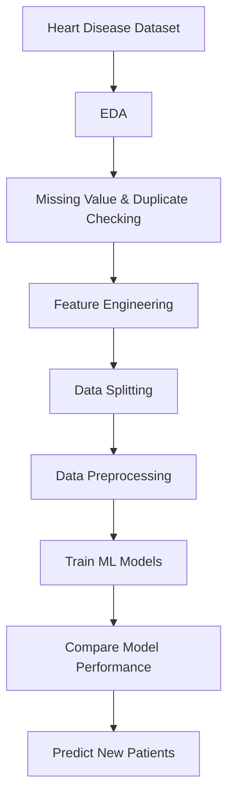

# Heart Disease Prediction

## Overview

A machine learning project developed to predict heart disease using patient clinical data. The project covers the complete machine learning workflow, including exploratory data analysis (EDA), feature engineering, data preprocessing, model training, evaluation, and prediction.

## Workflow

## Features

- Exploratory Data Analysis (EDA)
- Feature Engineering
- Data Preprocessing Pipeline
- Model Comparison
- Performance Evaluation
- Heart Disease Prediction

## Machine Learning Models

- Random Forest
- Support Vector Machine (SVM)
- Logistic Regression
- Naive Bayes
- Neural Network

## Technologies

- Python
- Pandas
- NumPy
- Scikit-learn
- TensorFlow / Keras
- Matplotlib
- Seaborn
- Joblib

## Dataset

Heart Disease Clinical Dataset

## Author

Tung Jia Jun
